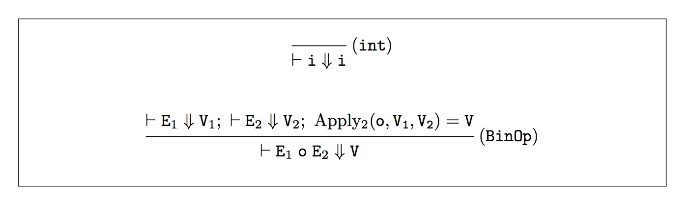

# CSCI 3366 Programming Languages

R. Muller

## Problem Set 4: Grammars & Parsing

### Due: Friday February 14, 2020, 6PM

### (12 Points)

---

## Part 1 (5 Points): Grammar Hacking

This part is mostly paper and pencil work. When you've completed the definitions required for 1 - 4, type them into a text file named **part1.txt** and include this file in your git repository that you submit as your solution.

1. (1 Point) In Java, the symbols that can be used for naming **classes**, **interfaces** and **generic type variables** must start with a capital letter. For example, one can write **Stack** but not **stack**. The characters following the first letter can be upper or lower case, they can be digits or the special character **_**. (There are other special characters but we'll ignore them here.)

   Assume the existence of nonterminal symbols **Upper**, **Lower** and **Special** that define (resp) the languages of uppercase letters **A**..**Z**, the language of lowercase letters **a**..**z** and the language of special characters **0, ..., 9, _**.

   ```
   Upper ::= A | B | ... | Z
   Lower ::= a | b | ... | z
   Special ::= 0 | ... | 9 | _
   ```

   Define a grammar with start symbol **CIGIdent** for Java class, interface or generic variable names. This particular grammar does not have to account for the generic type variables that can appear as suffixes to these names as in, e.g, **`Stack<T>`**. For the purposes of this problem, the symbols can be arbitrarily long.

2. (1 Point) The language of Java type expressions is fairly involved. For example, there are array types and there are extended generic types, including wildcards such as **`List<? extends Number>`**. Write a grammar with start symbol **Type** for **simple types**. The language defined by this grammar should include Java's eight base types: 

   ```
   byte, short, long, int, float, double, char, void
   ```

   as well as the types given by classes and or interfaces. This little language should account for generics that do not involve extension or wildcards. For example, **`List<T>`** and **`Box<S, T>`** and even nesting **`Box<S<T>>`**. The language defined by your grammar should exclude illegal forms such as **`List<>`** or **`Box<int>`**.

3. (1 Point) In Java, specifications of the types of functions (aka "methods") are called **signatures** (or sometimes **prototypes**). For example, the phrase **Bar makeBar(Item i, double x);** specifies the type of a function named **makeBar** that produces a value of type **Bar** when given inputs of type **Item** and **double**. Assuming the definition of a nonterminal symbol **Id** that defines the language of symbols for **identifiers** that might appear (such as **makeBar**, **i** and **x**), define a grammar with start symbol **FunSig** that defines the language of function signatures. These should account for functions that accept zero or more arguments. You can ignore the visibility properties **public** etc.

4. (1 Point) Interfaces in Java usually contain sequences of function signatures. For example, one might have

   ```java
   interface Stack<One> extends Something<Two> {  
     void push(T item);  
     T pop();  
     bool isEmpty();
   }
   ```

   Using your definitions of **FunSig** and **Type** and assuming the definition of a nonterminal symbol **Id** that defines the language of symbols for **identifiers** that might appear (such as **push**, **item**, **pop** and **isEmpty**). Define a grammar with start symbol **Interface** that defines a language of interfaces that contain lists of function signatures. Your grammar should account for empty interfaces such as **interface I {}**.

---


## Part 2 (7 Points): Parsing Mercury

Mercury is a trivial pedagogical "programming" language featuring only integer expressions with binary operators `+`, `-`, `*`, `/` and `%` (mod). A REPL implementation of Mercury allows expressions to be entered with or without parentheses. You can run a solved version of the problem set by typing

```bash
> cd
> cd csci3366/ps4-YOURGITHUBID/src/
> ./solved
```

This will fire up Mercury's REPL.

```
Mercury> 2 + 3 * 4
ast = +(2, *(3, 4))
value = 14

Mercury> (2 + 3) * 4
ast = *(+(2, 3), 4)
value = 20
```

Type `ctrl-d` to exit.

The operators are all left-associative and with the usual precedence. Evaluation is straightforward with one important property: Mercury traps *division by zero* errors.

```
Mercury> 2 / 0
Fatal error: exception Failure("divide: attempting to divide by zero.")
```

In this problem set, you are required to left-factor a grammar for Mercury's concrete syntax and write a recursive-descent parser based on the resulting grammar.

The directory `src/bin` contains OCaml harness code implementing most of a REPL (parser + evaluator) for the mini-PL Mercury.  The files in this directory are:

```
ast.ml          dune            eval.ml         repl.ml         token.ml
ast.mli         dynamic.ml      eval.mli        repl.mli        token.mli
basis.ml        dynamic.mli     main.ml         symbol.ml       tokenizer.ml
basis.mli       env.ml          parser.ml       symbol.mli      tokenizer.mli
debug.ml        env.mli         parser.mli      test.ml
```

You should give these files a good once-over before you begin coding. I suggest first looking at `token.mli`, `symbol.mli` and then `ast.mli`.

 Once you begin coding, your work will largely be confined to the file `parser.ml`. In particular, you're required to implement the single function specified in `parser.mli`

```ocaml
val parser : Token.t list -> Ast.t 
```

> **Heads up!** The `Token` module has a lot of tokens that are not used in Mercury. This is because the `Token` module will be used for other mini-programming languages. The tokens that appear in well-formed Mercury programs are
>
> ```ocaml
> PLUS | MINUS | TIMES | DIV | MOD | LPAR | RPAR | INTEGER of int | QUIT
> ```

To compile and run your implementation of the Mercury REPL:

```bash
> cd src
> dune exec bin/main.exe
Mercury >
```

To compile and run the unit tests for problem set 4:

```bash
> cd src
> dune exec bin/main.exe test
```

---

### The Parser

Let `i` denote an integer token. Then the concrete syntax for Mercury is given by the following context-free grammar where `E` is the start symbol.

```
V ::= i
E ::= E + T | E - T | T
T ::= T * F | T / F | T % F | F
F ::= V | ( E )
```

This grammar uses left-recursion to make all operators associate to the left and uses layering to give `*`, `/` and `%` higher precedence than `+` and `-`.

In order to write a recursive descent parser for Mercury, you'll need to left-factor this grammar using the rule:
$$
A ::= A \alpha \mid \beta
$$
Is replaced by two rules:
$$
A ::= \beta A' \hskip .5in A' ::= \alpha A' \mid \epsilon
$$
Once you've left-factored the grammar, you can use it as a guide to write a set of mutually recursive functions, each responsible for parsing a portion of the language. Of course, each will need to build an ast as defined in **ast.ml.**  If the sequence of tokens don't give rise to a well-formed Mercury program, your code use raise an exception using `failwith`.

**Abstract Syntax**

The grammar above specifies the *concrete* syntax of Mercury. The abstract syntax is simpler:

```
V  ::= i
op ::= + | - | * | / | %
E  ::= V | E op E
```

 You'll note there that we are treating the familiar infix operators as though they were ordinary prefix functions. For example, the concrete syntax `"2 + 3"` would be represented by the application:

```ocaml
Ast.App { rator = Symbol.fromString "+"
        ; rands = [Ast.Literal 2; Ast.Literal 3]
        }
```

The value of the expression above would be represented by `Dynamic.Literal 5`. 

---

#### The Interpreter

The semantics of Mercury are obviously trivial but we'll go ahead and give the formal rules just so we get used to them. Since there are no variables, we can use judgements of the following form:
$$
\vdash E \Downarrow V
$$
This means that expression $E$ evaluates to value $V$. As usual, we'll use an axiomatic system to specify the evaluation relation:
$$
\mbox{eval} = \{ (E, V) \mid\; \vdash E \Downarrow V \}
$$

